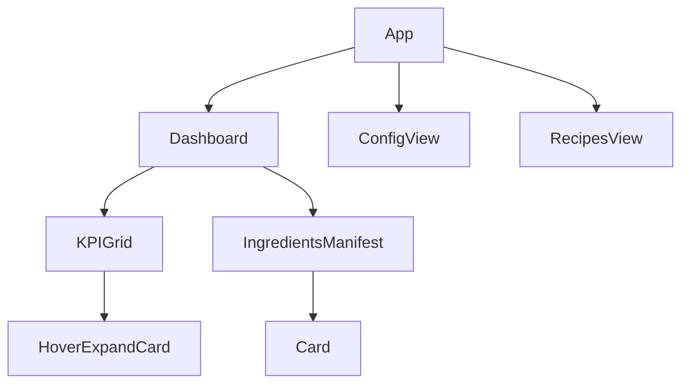

# Architecture

## Project Structure

```
src/
├── components/
│   ├── dashboard/      # KPI cards, main dashboard
│   ├── manifest/       # Ingredients manifest, exports
│   ├── ui/             # Reusable UI components (Card, StickyNote)
│   └── views/          # Page views (Config, Recipes, etc.)
├── context/
│   └── configContext.tsx  # Global configuration state
├── lib/
│   └── types.ts        # TypeScript type definitions
└── styles/
    └── theme.ts        # Centralized Glass UI theme constants
```

## Key Components



## Design System

The app uses a **Glass UI** aesthetic with:
- Translucent dark backgrounds (`bg-stone-900/70`)
- Backdrop blur (`backdrop-blur-xl`)
- Subtle borders (`border-white/15`)
- Accent colors for status indicators

Theme constants are centralized in `src/styles/theme.ts`.

## Data Flow

1. **ConfigContext** provides global settings
2. **Recipe configs** define ingredient ratios
3. **Calculations** scale based on batch size
4. **Manifest** aggregates all ingredients with costs
